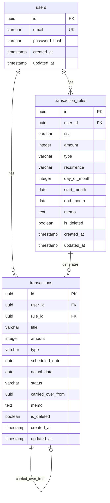
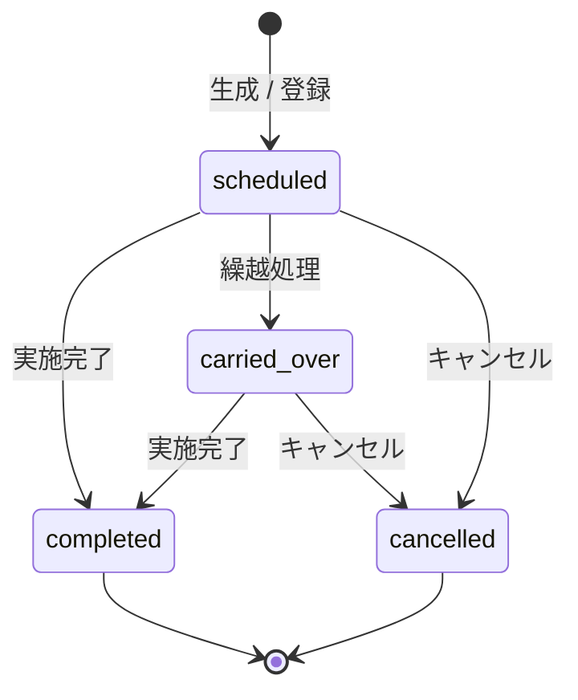

# PayTrack DB設計書

## 1. 文書情報
| 項目 | 内容 |
|------|------|
| 文書名 | PayTrack DB設計書 |
| バージョン | v1.0 |
| 作成日 | 2026-03-19 |
| RDBMS | PostgreSQL 16 |

---

## 2. ER図



---

## 3. テーブル定義

### 3.1 users（ユーザー）

| カラム名 | データ型 | NULL | デフォルト | 制約 | 説明 |
|---------|---------|------|-----------|------|------|
| id | UUID | NO | gen_random_uuid() | PK | ユーザーID |
| email | VARCHAR(255) | NO | - | UNIQUE | メールアドレス |
| password_hash | VARCHAR(255) | NO | - | - | bcryptハッシュ化パスワード |
| created_at | TIMESTAMP WITH TIME ZONE | NO | CURRENT_TIMESTAMP | - | 作成日時 |
| updated_at | TIMESTAMP WITH TIME ZONE | NO | CURRENT_TIMESTAMP | - | 更新日時 |

**インデックス:**
| インデックス名 | カラム | 種別 | 用途 |
|---------------|--------|------|------|
| users_pkey | id | PRIMARY | 主キー |
| users_email_key | email | UNIQUE | メールアドレス検索・一意制約 |

---

### 3.2 transaction_rules（入出金ルール）

| カラム名 | データ型 | NULL | デフォルト | 制約 | 説明 |
|---------|---------|------|-----------|------|------|
| id | UUID | NO | gen_random_uuid() | PK | ルールID |
| user_id | UUID | NO | - | FK → users.id | ユーザーID |
| title | VARCHAR(255) | NO | - | - | 件名 |
| amount | INTEGER | NO | - | CHECK (amount > 0) | 金額（正の整数） |
| type | VARCHAR(20) | NO | - | CHECK (type IN ('income', 'expense')) | 種別 |
| recurrence | VARCHAR(20) | NO | - | CHECK (recurrence IN ('once', 'monthly')) | 繰り返し種別 |
| day_of_month | INTEGER | YES | NULL | CHECK (day_of_month BETWEEN 1 AND 31) | 毎月の実行日（monthly時必須） |
| start_month | DATE | YES | NULL | - | 開始月（月初日で保存） |
| end_month | DATE | YES | NULL | - | 終了月（月初日で保存） |
| memo | TEXT | YES | NULL | - | メモ |
| is_deleted | BOOLEAN | NO | FALSE | - | 論理削除フラグ |
| created_at | TIMESTAMP WITH TIME ZONE | NO | CURRENT_TIMESTAMP | - | 作成日時 |
| updated_at | TIMESTAMP WITH TIME ZONE | NO | CURRENT_TIMESTAMP | - | 更新日時 |

**制約:**
- `recurrence = 'monthly'` の場合、`day_of_month` は必須（アプリケーション層で検証）
- `end_month` が指定される場合、`start_month <= end_month` であること
- `start_month`・`end_month` は各月の1日で保存（例: 2026-04-01）

**インデックス:**
| インデックス名 | カラム | 種別 | 用途 |
|---------------|--------|------|------|
| transaction_rules_pkey | id | PRIMARY | 主キー |
| idx_transaction_rules_user_id | user_id | BTREE | ユーザー別ルール取得 |
| idx_transaction_rules_user_not_deleted | user_id, is_deleted | BTREE (PARTIAL: is_deleted = FALSE) | アクティブルール取得 |

---

### 3.3 transactions（入出金トランザクション）

| カラム名 | データ型 | NULL | デフォルト | 制約 | 説明 |
|---------|---------|------|-----------|------|------|
| id | UUID | NO | gen_random_uuid() | PK | トランザクションID |
| user_id | UUID | NO | - | FK → users.id | ユーザーID |
| rule_id | UUID | YES | NULL | FK → transaction_rules.id | 元ルールID（手動登録時はNULL） |
| title | VARCHAR(255) | NO | - | - | 件名 |
| amount | INTEGER | NO | - | CHECK (amount > 0) | 金額（正の整数） |
| type | VARCHAR(20) | NO | - | CHECK (type IN ('income', 'expense')) | 種別 |
| scheduled_date | DATE | NO | - | - | 予定日 |
| actual_date | DATE | YES | NULL | - | 実施日（completed時に設定） |
| status | VARCHAR(20) | NO | 'scheduled' | CHECK (status IN ('scheduled', 'completed', 'carried_over', 'cancelled')) | ステータス |
| carried_over_from | UUID | YES | NULL | FK → transactions.id | 繰越元トランザクションID |
| memo | TEXT | YES | NULL | - | メモ |
| is_deleted | BOOLEAN | NO | FALSE | - | 論理削除フラグ |
| created_at | TIMESTAMP WITH TIME ZONE | NO | CURRENT_TIMESTAMP | - | 作成日時 |
| updated_at | TIMESTAMP WITH TIME ZONE | NO | CURRENT_TIMESTAMP | - | 更新日時 |

**制約:**
- `status = 'completed'` の場合、`actual_date` は必須（アプリケーション層で検証）
- `carried_over_from` は `status = 'scheduled'` で繰越先として生成された場合にのみ設定

**インデックス:**
| インデックス名 | カラム | 種別 | 用途 |
|---------------|--------|------|------|
| transactions_pkey | id | PRIMARY | 主キー |
| idx_transactions_user_id | user_id | BTREE | ユーザー別取得 |
| idx_transactions_user_scheduled_date | user_id, scheduled_date | BTREE | 月別一覧取得 |
| idx_transactions_user_status | user_id, status | BTREE | ステータス別集計 |
| idx_transactions_rule_scheduled | rule_id, scheduled_date | BTREE | バッチ重複チェック |
| idx_transactions_carried_over | carried_over_from | BTREE | 繰越参照 |

---

## 4. ステータス遷移図



---

## 5. DDL

```sql
-- 拡張機能
CREATE EXTENSION IF NOT EXISTS "pgcrypto";

-- users
CREATE TABLE users (
    id UUID PRIMARY KEY DEFAULT gen_random_uuid(),
    email VARCHAR(255) NOT NULL UNIQUE,
    password_hash VARCHAR(255) NOT NULL,
    created_at TIMESTAMP WITH TIME ZONE NOT NULL DEFAULT CURRENT_TIMESTAMP,
    updated_at TIMESTAMP WITH TIME ZONE NOT NULL DEFAULT CURRENT_TIMESTAMP
);

-- transaction_rules
CREATE TABLE transaction_rules (
    id UUID PRIMARY KEY DEFAULT gen_random_uuid(),
    user_id UUID NOT NULL REFERENCES users(id) ON DELETE CASCADE,
    title VARCHAR(255) NOT NULL,
    amount INTEGER NOT NULL CHECK (amount > 0),
    type VARCHAR(20) NOT NULL CHECK (type IN ('income', 'expense')),
    recurrence VARCHAR(20) NOT NULL CHECK (recurrence IN ('once', 'monthly')),
    day_of_month INTEGER CHECK (day_of_month BETWEEN 1 AND 31),
    start_month DATE,
    end_month DATE,
    memo TEXT,
    is_deleted BOOLEAN NOT NULL DEFAULT FALSE,
    created_at TIMESTAMP WITH TIME ZONE NOT NULL DEFAULT CURRENT_TIMESTAMP,
    updated_at TIMESTAMP WITH TIME ZONE NOT NULL DEFAULT CURRENT_TIMESTAMP
);

CREATE INDEX idx_transaction_rules_user_id ON transaction_rules(user_id);
CREATE INDEX idx_transaction_rules_user_not_deleted ON transaction_rules(user_id) WHERE is_deleted = FALSE;

-- transactions
CREATE TABLE transactions (
    id UUID PRIMARY KEY DEFAULT gen_random_uuid(),
    user_id UUID NOT NULL REFERENCES users(id) ON DELETE CASCADE,
    rule_id UUID REFERENCES transaction_rules(id) ON DELETE SET NULL,
    title VARCHAR(255) NOT NULL,
    amount INTEGER NOT NULL CHECK (amount > 0),
    type VARCHAR(20) NOT NULL CHECK (type IN ('income', 'expense')),
    scheduled_date DATE NOT NULL,
    actual_date DATE,
    status VARCHAR(20) NOT NULL DEFAULT 'scheduled' CHECK (status IN ('scheduled', 'completed', 'carried_over', 'cancelled')),
    carried_over_from UUID REFERENCES transactions(id) ON DELETE SET NULL,
    memo TEXT,
    is_deleted BOOLEAN NOT NULL DEFAULT FALSE,
    created_at TIMESTAMP WITH TIME ZONE NOT NULL DEFAULT CURRENT_TIMESTAMP,
    updated_at TIMESTAMP WITH TIME ZONE NOT NULL DEFAULT CURRENT_TIMESTAMP
);

CREATE INDEX idx_transactions_user_id ON transactions(user_id);
CREATE INDEX idx_transactions_user_scheduled_date ON transactions(user_id, scheduled_date);
CREATE INDEX idx_transactions_user_status ON transactions(user_id, status);
CREATE INDEX idx_transactions_rule_scheduled ON transactions(rule_id, scheduled_date);
CREATE INDEX idx_transactions_carried_over ON transactions(carried_over_from);

-- updated_at 自動更新トリガー
CREATE OR REPLACE FUNCTION update_updated_at()
RETURNS TRIGGER AS $$
BEGIN
    NEW.updated_at = CURRENT_TIMESTAMP;
    RETURN NEW;
END;
$$ LANGUAGE plpgsql;

CREATE TRIGGER trg_users_updated_at
    BEFORE UPDATE ON users FOR EACH ROW EXECUTE FUNCTION update_updated_at();

CREATE TRIGGER trg_transaction_rules_updated_at
    BEFORE UPDATE ON transaction_rules FOR EACH ROW EXECUTE FUNCTION update_updated_at();

CREATE TRIGGER trg_transactions_updated_at
    BEFORE UPDATE ON transactions FOR EACH ROW EXECUTE FUNCTION update_updated_at();
```

---

## 6. 設計方針

| 項目 | 方針 |
|------|------|
| ID生成 | UUID v4（gen_random_uuid()） |
| 削除 | 論理削除（is_deleted フラグ） |
| タイムゾーン | TIMESTAMP WITH TIME ZONE を使用 |
| 日付 | DATE型（タイムゾーン不要な日付項目） |
| 更新日時 | トリガーによる自動更新 |
| ルールと実データの分離 | transaction_rules がテンプレート、transactions が実データ |
